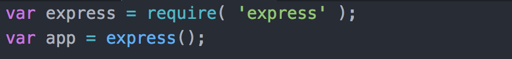
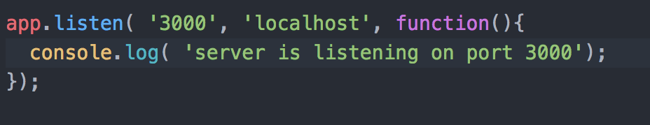
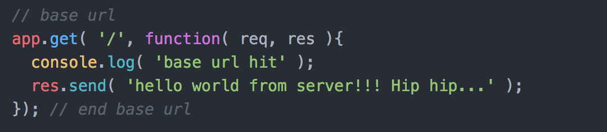
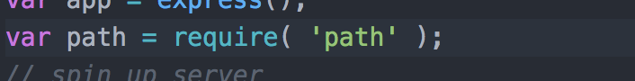
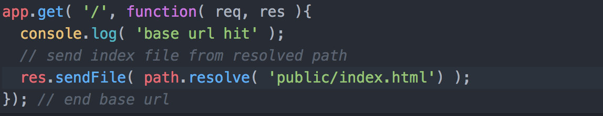

Pi Node Express Setup In Class
==============================

step by step instructions
-------------------------

* create project folder
* 'npm init' in this folder in terminal
* fill out project details (as much as you feel the need)
* you should now have 'package.json' in this folder

installing dependencies
-----------------------
* 'npm install express --save' in terminal
* you'll get some feedback in terminal, then will see a new "node_modules" folder
* also, 'package.json' will have 'express' and a version listed in a new dependencies portion

create your server
-------------------
* create 'server' folder
* create 'app.js' inside server folder
* require express and create an express app variable

* spin up a server on a port with the 'app.listen' command

* start server ('node server/app.js' in terminal)
* you should see "server is listening on port 3000" in your terminal

* remember: console.log on server side will show in terminal

create a route for the server
-----------------------------
* add a base route "app.get"

* restart server
* refresh "localhost:3000" in browser
* observe the awesome

set up to serve an html file
----------------------------
* require path module

* create 'public' folder in project root
* create 'index.html' in 'public' folder
* update 'app.get' to send this in response from a resolved path

